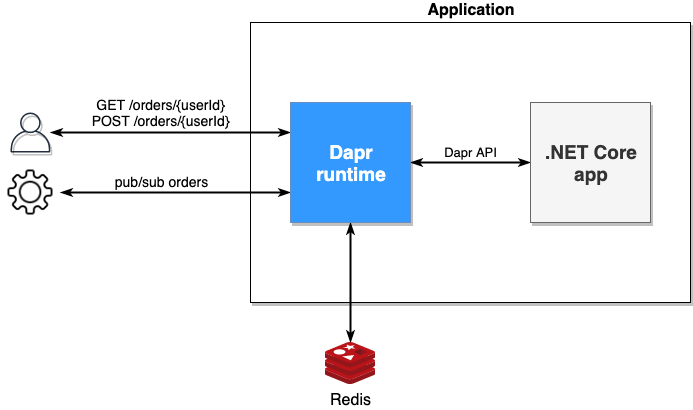

# dapr-experiment
Just a sample app to mess around with [Dapr](https://github.com/dapr/dapr) and the [Dapr .Net SDK](https://github.com/dapr/dotnet-sdk).

## Overview


## Running the application locally
Dapr and the application can be started simultaneously with the following command:
```
dapr run --app-id ordersapp --app-port 5000 dotnet run
```

While Dapr and application are running, `OrderEvents` can be published to the application with the wfollowing command:
```
dapr publish -t orders -p '{"userId": "<user_id>", "data": "<some_string_data_here>"}'
```